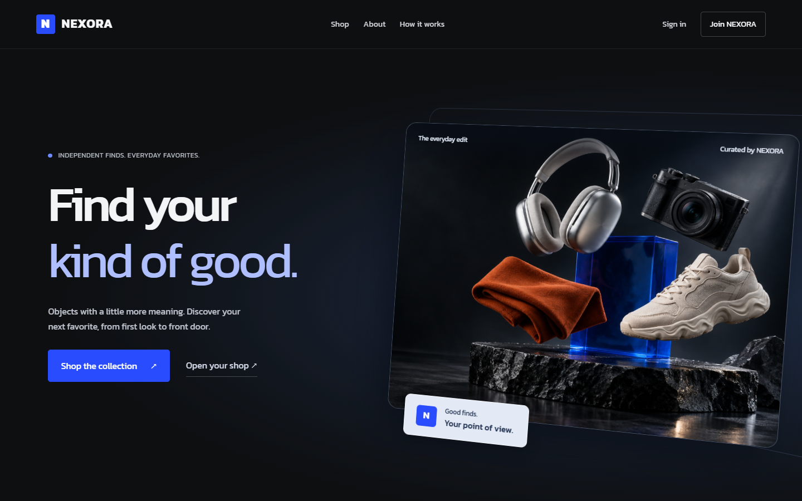
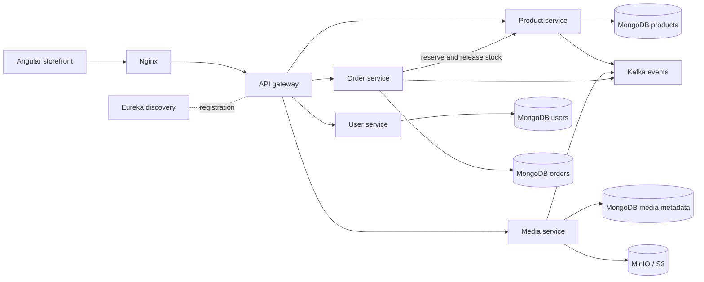

# Nexora Commerce

A complete marketplace built with **Angular, Java 17, Spring Boot, MongoDB,
Kafka, and S3-compatible storage**. One repository takes the application from
product discovery to checkout, order fulfilment, automated testing, and deployment.



## Run locally

Install Docker Desktop and start its Linux container engine. No local Java,
Maven, Node, or database installation is required for the Docker workflow.

```powershell
git clone https://github.com/hujaafar/nexora-commerce.git
cd nexora-commerce
.\scripts\start.ps1
```

On macOS or Linux:

```bash
git clone https://github.com/hujaafar/nexora-commerce.git
cd nexora-commerce
bash scripts/start.sh
```

Open **[localhost:4200](http://localhost:4200)**. The startup script generates
random local secrets, builds the services, waits for health checks, and adds the
sample catalog without replacing existing products. The initial build downloads
dependencies and takes several minutes.

| Demo role | Email | Password |
|---|---|---|
| Customer | `client@nexora.local` | `Client123!` |
| Seller | `seller@nexora.local` | `Seller123!` |
| Administrator | `admin@nexora.local` | `Admin123!` |

These are intentionally public local demo accounts. See [deployment](docs/DEPLOYMENT.md)
before exposing an installation on the internet.

Stop with `docker compose down`. Named volumes keep your data for the next run.

## Try the complete journey

1. Browse and filter the catalog without an account.
2. Sign in as the customer, save a product, and add items to the bag.
3. Enter a delivery address, review server-calculated totals, and place an order.
4. Sign in as the seller to manage inventory and move the order through fulfilment.
5. Return as the customer to follow the timeline, cancel an eligible order, or reorder.
6. Sign in as the administrator to inspect accounts and moderate products and uploaded media.

Checkout supports **pay on delivery** and a clearly labelled **card simulation**.
The demo does not charge real cards or connect to a courier.

## Included

- Responsive storefront with the ScrollCraft engine used in Neo4flix: a floating
  collection frame, scroll-driven depth, readable sliding panels, and entry reveals.
- Product galleries with directional image transitions, synchronized thumbnails
  and counters, previous/next controls, and arrow-key navigation.
- Reduced-motion and compact-screen layouts, keyboard navigation, real loading
  and error states, and motion cleanup when routes change.
- JWT authentication, BCrypt passwords, role and ownership checks, gateway rate
  limits, validated uploads, seller media library, and profile avatars.
- Search, category and price filters, sorting, pagination, cart, wishlist,
  checkout, stock reservations, order history, cancellation, and seller analytics.
- Six independently packaged Spring services, service discovery, persistent
  databases, event publishing, and object storage.
- GitHub Actions CI, Jenkins build/test/deploy/rollback pipeline, SonarQube quality
  gate configuration, JaCoCo and Angular coverage, and API integration tests.
- Nexus artifact management: dependency caching, versioned service JARs and Docker
  images, immutable releases, publisher/read-only roles, and recovery tooling.

See the [five-brief requirements matrix](docs/REQUIREMENTS_CHECKLIST.md) for
coverage and the [verification record](docs/VALIDATION.md) for measured results.
The [motion design and browser review](docs/MOTION_DESIGN.md) explains the animation
reference, responsive composition, and visual verification.
The standalone Nexus artifact verifier builds on Java 11; the marketplace uses
Java 17. A strict Java 11 requirement for the entire storefront remains a platform
migration decision.

## Architecture



Each service owns its data. Checkout obtains current prices and reserves stock
through the product service. Failed placement attempts compensate reservations;
cancelling an eligible order releases stock. This is a portfolio implementation,
not a distributed transaction across every external side effect.

| Folder | Responsibility |
|---|---|
| `frontend/` | Angular application and storefront motion |
| `gateway-service/` | API routes, JWT validation, CORS, rate limiting |
| `discovery-service/` | Eureka registry |
| `user-service/` | Identity, profiles, roles, demo accounts |
| `product-service/` | Catalog, search, inventory reservations |
| `media-service/` | Upload validation, ownership, S3 storage |
| `order-service/` | Cart, wishlist, checkout, orders, analytics |
| `jenkins/`, `quality/`, `nexus/` | Optional CI, quality gates, and artifact storage |
| `scripts/` | Setup, seeding, operations, verification |
| `docs/` | Architecture, APIs, deployment, migration, learning notes |

## Development and verification

With Java 17 and Node 24 LTS (recommended on Windows):

```bash
./mvnw verify
cd frontend
npm ci
npm run test:ci
npm run build
npm start
```

Use `mvnw.cmd verify` in PowerShell. The frontend development server proxies
`/api` to the gateway on port 8080. Production assets are served by Nginx.
Node 22.12 also builds the Linux container image; Node 24 avoids a Windows
worker startup problem observed with Node 22.12 and Vitest.

With the full application running:

```bash
node scripts/integration-test.mjs
cd frontend
npm run test:e2e
```

The test creates identifiable accounts/products and verifies real API behavior:
authorization, media validation, cart, wishlist, checkout, inventory, cancellation,
and fulfilment. Temporary products and media are removed; test accounts and the
fulfilled order remain as demo evidence. See [validation](docs/VALIDATION.md).

## CI and quality

GitHub Actions runs Java tests, Angular tests/build, the production dependency
audit, and configuration checks on hosted runners. No private runner or secret
is needed for the default CI workflow.

For the optional local SonarQube and Jenkins stack:

```powershell
.\scripts\start-nexus.ps1
.\scripts\provision-nexus.ps1
.\scripts\sonarqube-start.ps1
.\scripts\jenkins-start.ps1
```

Use the corresponding `.sh` scripts on Linux/macOS. Open SonarQube on port 9000,
Jenkins on 8088, and the local Mailpit inbox on 8025. Generated credentials stay
in ignored `.env` files. Local notifications go to Mailpit; external email is
an explicit operator configuration.

Default CI scans every push and PR with disposable Docker SonarQube and runs a
weekly scan. Its blocking gate evaluates the complete candidate snapshot. Main
requires independent review and all five CI checks; see [review policy](docs/REVIEW_POLICY.md).

The separate optional GitHub Sonar workflow is manually triggered and requires a
runner-reachable `SONAR_HOST_URL` repository variable and `SONAR_TOKEN` secret.
A developer's localhost is not reachable from GitHub-hosted runners.

For dependency caching and versioned JAR/Docker publication, see the complete
[Nexus setup and recovery guide](docs/NEXUS_SETUP.md). Nexus runs alongside the
application on ports 18081/18082 and integrates with the same Jenkins pipeline.

## Project lineage and credits

Nexora consolidates the marketplace foundations from `buy-01`, CI/CD from
`mr-jenk`, quality and media fixes from `safe-zone`, and commerce workflows from
`buy-02`, plus artifact management from `nexus`. It is one runnable application. See [migration notes](docs/MIGRATION.md)
and [source commits](docs/source-provenance.json).

The ScrollCraft runtime retains its MIT license and includes a documented
Angular lifecycle adaptation. The hero is original generated artwork. Demo
product records and externally hosted thumbnails come from
[DummyJSON](https://dummyjson.com/docs/products); prices are sample data.
See [third-party notices](THIRD_PARTY_NOTICES.md).
