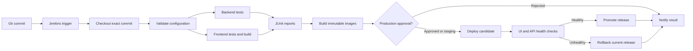

> Retained educational reference from the component projects. For current commands, architecture, and verification, use the root README and VALIDATION.md.

<!--
File purpose: Explains the project's CI/CD design and interview concepts in simple language.
-->
# CI/CD architecture and interview guide

## Pipeline flow

## Concepts in simple words

| Concept | Simple definition | How this project uses it |
|---|---|---|
| Continuous Integration (CI) | Every change is automatically compiled and tested. | Git changes trigger checkout, validation, backend tests, frontend tests, and reports. |
| Continuous Deployment (CD) | A tested version is automatically released in the same repeatable way. | Jenkins builds images, deploys Compose, verifies HTTP routes, and promotes the release. |
| Jenkins controller | The Jenkins process that stores configuration and schedules work. | The custom controller is created by `jenkins/compose.yml`. |
| Agent | A machine or container that executes Pipeline steps. | One dedicated Docker agent executes builds by default; a second is enabled with the distributed profile. Each has one executor; the controller has zero. |
| WebSocket agent | A worker connected through Jenkins' normal HTTP path instead of a separate inbound TCP port. | The Compose agent connects automatically without exposing port 50000. |
| Least privilege | Give an identity only the permissions needed for its one job. | The agent bootstrap user can read Jenkins and connect the node, but cannot administer Jenkins or modify jobs. |
| Mailpit | A local SMTP inbox that captures email instead of sending it to real people. | Success and failure messages can be proved at `localhost:8025`. |
| Pipeline | The complete automated delivery workflow stored as code. | `Jenkinsfile` is reviewed and versioned beside the application. |
| Stage | A named section of the Pipeline. | Checkout, tests, images, approval, deployment, and rollback are separate stages. |
| Trigger | An event or schedule that starts automation. | The job polls Git; a webhook can trigger it immediately. |
| Artifact | A file saved from a build for later inspection. | Test XML, coverage, and deployment logs are archived. |
| Fail-fast | Stop useful work as soon as a required operation fails. | Failed tests stop packaging and deployment; parallel tests abort quickly. |
| Immutable image | A packaged application version whose tag never changes. | Tags contain the Git commit and Jenkins build number instead of `latest`. |
| Health check | A test that asks whether a running component is ready. | Compose checks individual containers during startup. |
| Smoke test | A short check of the most important real user path. | Jenkins requests the deployed UI and `/api/products`. |
| Rollback | Restore the last known healthy release after a bad one. | The scripts retain current/previous tags and re-verify the restored release. |
| JCasC | Jenkins Configuration as Code: controller settings stored in YAML. | Security, credentials, variables, and jobs load from `jenkins.yaml`. |
| Job DSL | Code that creates Jenkins jobs consistently. | JCasC runs a DSL script that creates the `nexora-commerce` Pipeline job. |
| Parameterized build | A build whose safe choices are selected when it starts. | Action, environment, approval, timeout, notification, and agent are parameters. |
| Distributed build | Work executed away from the controller and optionally across multiple workers. | Two separate two-executor workers share a generic label and also expose unique selectable labels. |

## Why use both container checks and HTTP checks?

A container can be running while the application inside it is broken. For
example, Nginx might respond but the gateway cannot discover the product
service. Compose health checks catch component readiness. The final HTTP checks
exercise the same frontend and API routes used by a real browser. Requiring
both gives stronger evidence that the release works.

## Why keep candidate, current, and previous?

- `candidate` identifies what Jenkins is trying now.
- `current` is the version proven healthy.
- `previous` lets an operator undo the most recent healthy promotion.

The scripts update `current` only after the real HTTP checks pass. This small
state machine prevents a failed candidate from replacing the rollback target.

## Why immutable tags matter

If every deployment uses `latest`, nobody can prove which code is running and a
rollback might download different bytes later. A tag such as
`3f9a21bc0142-27` connects the release to one commit and one Jenkins run. That
makes deployments reproducible, logs traceable, and rollback predictable.

## A strong interview explanation

“I built a Jenkins Pipeline as code for a Java and Angular microservices
platform. Git changes trigger parallel Maven and frontend tests, and Jenkins
publishes JUnit and coverage reports. Successful commits become immutable
Docker images. The Pipeline deploys an isolated staging or production Compose
project, checks the public UI and API, and promotes the tag only after it is
healthy. A failed deployment automatically restores and verifies the last
healthy tag. Jenkins itself is reproducible through Docker, pinned plugins,
Configuration as Code, and Job DSL. Two dedicated Docker agents keep builds off
the controller and provide selectable distributed capacity, while Mailpit or
Gmail proves success and failure emails. Parameters support environment
selection, production approval, notifications, and agent selection.”

## Questions to practise

1. Why should a failed test prevent deployment?
2. What is the difference between a Docker health check and a smoke test?
3. Why is an immutable tag safer than `latest`?
4. When would you require manual production approval?
5. What happens when the first deployment fails and no rollback exists?
6. How does JCasC reduce configuration drift?
7. What secret values must never be committed?
8. How would two Jenkins agents make the Pipeline faster?
9. How would you make Jenkins and the deployed application highly available?
10. What evidence would you collect during a failed deployment?
