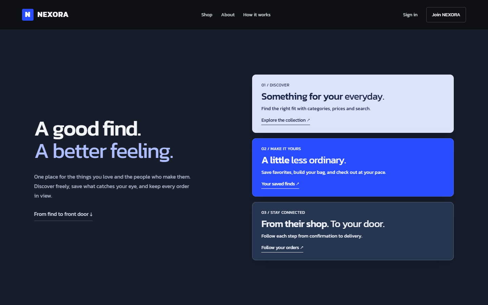
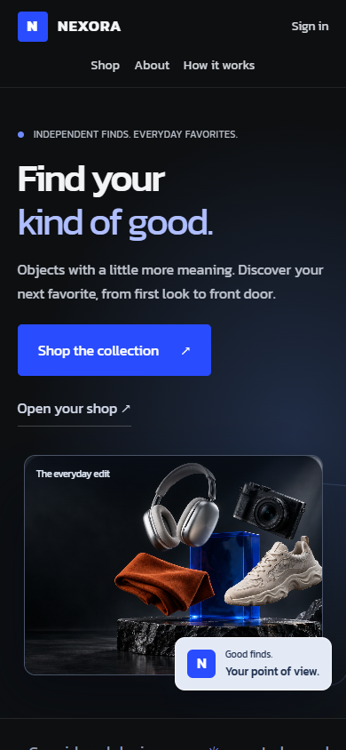

# Storefront motion

Nexora's collection now sits in a floating frame that settles toward the viewer
as the page scrolls. A rear outline, photographic frame, and foreground label
move independently. The existing dark/cobalt identity and catalog remain the
center of the experience.


## Reference and brief

The supplied Estates interaction video showed tilted application panels, image
zooms, and sliding detail views. Its movement informed this enhancement; the
reference video and its real-estate interface are not included in this repository.
The workflow follows [ScrollCraft](https://github.com/nateherkai/scroll-craft),
using the existing shared runtime without modifying its source in this change.
The existing Nexora hero image is reused. No assets were generated or purchased.

This brief reuses the established project and the user's motion reference.
The following design decisions are authored assumptions, not interview answers:

- Dimensional, composed, tactile movement within Nexora's current visual identity.
- Keep the hero, working catalog, marketplace story, order steps, and shopping close.
- Concentrate motion in the opening; keep browsing and the finish calmer.
- Give shoppers a feeling of curiosity, control, connection, clarity, then readiness.
- Make the collection frame, rear outline, and label settle at different depths.
- Retain the dark/cobalt palette, Kanit typography, and existing photography.
- Use separate scenes with direct catalog navigation and ordinary scrolling.
- Use the supplied video as a behavior reference and the existing image as the asset.

The page follows the existing commerce gallery structure. Filmic, worldflight,
and cutlist structures would delay browsing; a live surface would discard the
established hero. Editorial chapters, poster, and split-stage structures would
replace the established shopping sequence without a need. The first local
ScrollCraft registry was empty, so no prior registered build needed a fingerprint
comparison. This enhancement is not claimed as an original new brand or site.

## Journey and motion

| Beat | Motion | Intended response |
|---|---|---|
| Opening | Desktop pin, independent depth, fine-pointer tilt | Curiosity: the collection feels like a floating object |
| Catalog | Natural flow and brief entrance | Control: search, sort, and filter immediately |
| Story | Three separated panels gradually align | Connection: understand discovery, saving, and orders |
| Order steps | Short staggered entrances | Clarity: see what happens next |
| Close | Stable shopping link after a brief entrance | Readiness: return to the catalog |
| Product detail | Directional cross-slide between real image URLs | Confidence: selection, image, and counter agree |

The opening is the principal motion moment: “The collection floats into place as
I move into the shop.” It receives 2.15 viewport heights, compared with 1.65 for
the story. There are no intentionally empty pinned intervals. The memorable
experience is a floating collection becoming a straightforward shop.

At widths of 800px or below, the text and collection frame stack in normal flow
and the engine is not mounted. Reduced motion also avoids pinning and entrance
animations. Keyboard focus, wheel input, and touch interrupt a section-link scroll;
moving to another control cannot be pulled back by an unfinished animation.



## Verification

Local Chrome checks on Windows cover desktop 1440×900, phones at 390×844 and
360×640, and reduced motion. Native pointer lock/capture is disabled in automated
contexts. The final motion browser suite passes five tests:

1. Multiple hero positions, actual pointer-state pixel differences, catalog
   filtering/reset, product navigation, and engine teardown without page errors.
2. Phone content, overflow, shopping link, and focus visibility through every story panel.
3. The same checks on a compact phone viewport.
4. Reduced motion with accessible content and no running hero animations.
5. Gallery transitions, thumbnail selection, image count, arrow keys, and removal
   of the outgoing image after its transition.

These tests intercept product requests with a deterministic fixture. They check
UI behavior and do not replace the real commerce journeys in `marketplace.spec.ts`.
Both suites run against the production artifacts in hosted browser acceptance.

All 32 Angular tests and the three-cycle ScrollCraft lifecycle check passed
locally. The production build passed its error budgets; it retains warnings for
an initial bundle of about 542kB versus the 540kB warning threshold and the Windows
critical-CSS resolver's lookup of the separately served motion stylesheet. The
actual production package review checks the stylesheet, script, image and fonts
through HTTP. The asset-only review returns an explicit 503 for API requests.

The stock ScrollCraft harness captured 13 desktop samples across both pinned
sections, including six positions in each. Its contact sheet was inspected.
Two dead-scroll flags span the unannotated catalog and closing flow sections;
the harness skips those sections and does not measure the page's custom depth
transforms. These are detector limitations, not a claimed clean automated report.
The separate browser tests compare computed transforms and actual painted pixels.
The stock cue/contrast pass sees no `data-sc-cue` elements, so it does not certify
this page's contrast. Text readability was reviewed in the actual screenshots.

The review initially found clipped mobile story content, focus fighting the
slow anchor scroll, a search icon contaminating its accessible label, and a
decorative gallery corner intercepting the next button. Each was fixed and the
affected browser checks rerun. Visual inspection also caught a stretched image
badge; its positioning was corrected. The second failed browser run is retained
in the local work folder; the first run's screenshots were overwritten by a rerun,
so only its failure output remains. No earlier green result substitutes for the
final browser rerun.

The initial hosted quality scan rejected three duplicate CSS selectors and a
redundant word in an image's alternative text. The declarations were consolidated
without changing the intended style values. A follow-up scan still flagged the
Angular alternative-text expression, so it was simplified to the product name;
the separate gallery counter identifies the selected view. Both failed reports
are retained in the local work folder and the GitHub run artifacts.

The intended feeling sequence survives the final visual review: the opening
has the greatest change, the catalog stays useful, all story panels are readable,
and the close holds. The original overlapping story composition was changed to
separated panels because overlap weakened readability.



## Limits and reproduction

Phone checks use desktop Chrome viewport emulation, not a physical phone or
Safari. This change uses no scrub video or WebGL. Local backend verification is
limited while Docker is stopped for disk capacity; source repositories, containers,
and persistent volumes are retained. The animation preview demonstrates motion,
not a completed checkout or a running local backend.

Start the application using the root README, then run:

```bash
cd frontend
npm run test:ci
npm run build
npx playwright test e2e/storefront-motion.spec.ts
```

Use `http://localhost:4200/products` for the local storefront. See the PR checks
and [validation record](VALIDATION.md) for the separate full-stack CI evidence.
