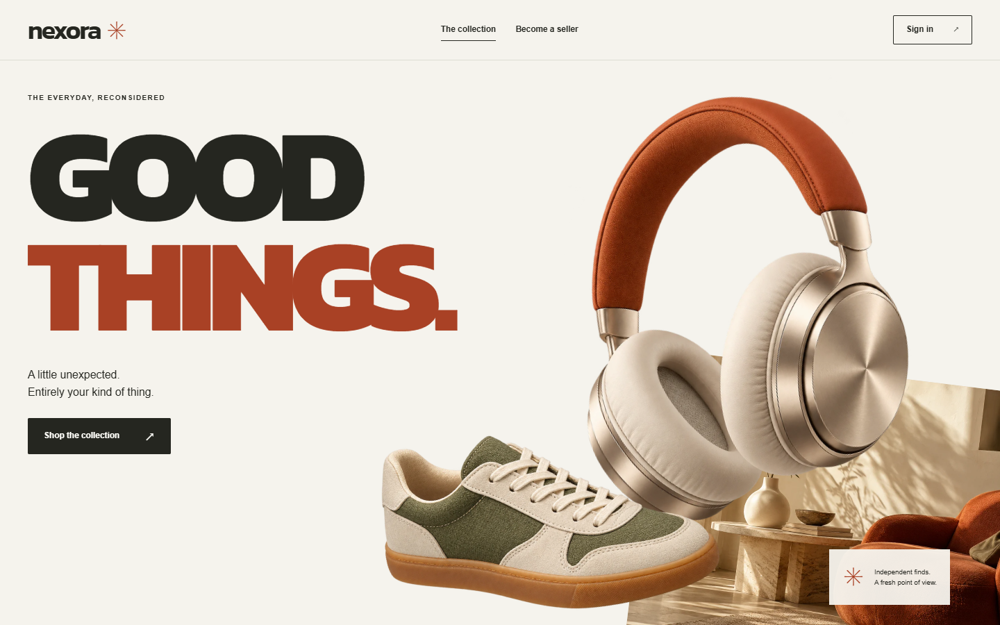
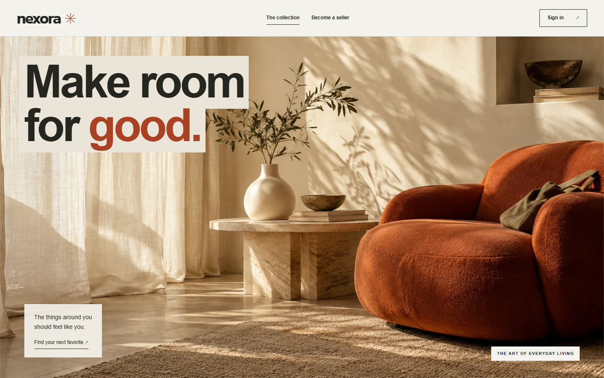
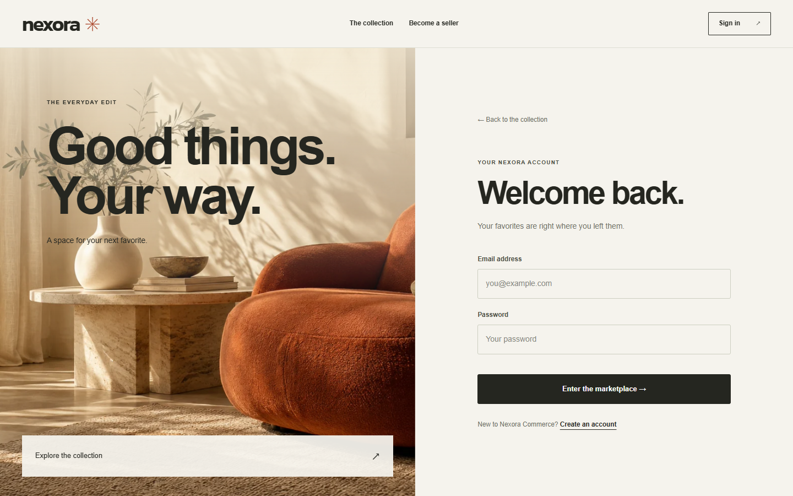

# Editorial storefront and motion

Nexora uses warm paper, off-black type, burnt orange, olive accents, and photographic campaign imagery throughout the application. The redesign includes discovery, product details, sign-in, registration, cart, checkout, saved products, orders, profile analytics, the seller workspace, image management, and moderation.



## Creative direction

The user requested a whole redesign with image animation and scroll effects like the earlier Neo4flix project. The [authored brief](REDESIGN_BRIEF.md) records that request separately from implementation decisions. Neo4flix's moving reel and camera entrance informed the spatial movement; Nexora uses independent photographic layers and an expanding room image. It does not render a 3D scene or play a scrub video.

The custom retail lookbook moves from a product-and-type opening through useful category shortcuts, an immersive photographic spread, the searchable catalog, and a shop/join invitation. The eight stock ScrollCraft grammars were considered in the brief. Their main tradeoffs were delaying direct shopping, reducing the requested imagery, or repeating the earlier gallery structure. Navigation, hero, sequence, ending, signature, and grammar differ from the previous Nexora refinement: **6 of 6 fingerprint dimensions**. The previous registry row remains intact.

## Journey and motion score

| Beat | Device and pace | Intended response |
|---|---|---|
| Opening | 1.7-screen desktop pin; headphones, shoe, photo and type move independently; fine-pointer tilt | Curiosity |
| Categories | Natural flow; image hover/focus; buttons set the real catalog category | Agency |
| Campaign peak | 2.2-screen desktop pin; photo aperture opens while the near object moves past | Delight |
| Catalog | Natural flow; short entry and alternate listing-image transition | Confidence |
| Membership | Stable split composition, brief shoe hover and working shopping/registration links | Belonging |
| Product detail | Cross-slide, thumbnails, counters and arrow-key navigation | Confidence in the selection |
| Account pages | One finite photographic entrance; calm forms and workspaces | Focus |

Signature: **a small picture opens into a room as the foreground product passes the viewer.** The room reveal has the largest visual change and longest scroll span. The ending remains visible and useful.

The visual review followed the intended curve: bold opening, useful choices, expanding room, clear catalog, inviting close. The first pass instead felt obstructed on phones because stretched image dimensions covered text and controls. Explicit image aspect handling, static reveal fallbacks, and non-interactive mobile artwork resolved that difference. Paper behind the campaign heading keeps the type readable as the image expands.




## Assets and performance

Three images were generated with the built-in image generation tool, inspected, and encoded as WebP. Their combined size is **623,358 bytes**. [Asset provenance and exact prompts](CAMPAIGN_ASSETS.md) distinguish campaign imagery from actual seller listings. Fonts and imagery are served locally; the storefront does not depend on a remote image service.

The production initial bundle is approximately **536 KB raw / 109 KB estimated transferred**, within the existing 540 KB warning and 600 KB error budgets. No animation library or production dependency was added. The shared ScrollCraft source is unchanged.

Phones use ordinary document flow with short scroll-linked image transforms. The desktop engine is not mounted at 800px or below. Mobile updates run outside Angular and are coalesced into one animation frame per scroll event. Reduced-motion mode keeps the complete static composition, catalog and controls. Route changes release the engine, observers and event handlers.

## Executed verification

- Production Angular build passed with the existing size budgets. Its existing Windows critical-CSS warning for the separately served `motion/scrollcraft.css` remains; browser checks confirm that stylesheet loads.
- All 32 Angular unit tests passed, including service-state behavior and motion disposal.
- Eight fixture-isolated browser tests passed: desktop painted movement and pointer tilt, two phone widths, reduced motion, gallery navigation, and 13 route/role combinations at each of 1440, 390 and 360 pixels.
- Browser checks exercised search/reset, direct catalog navigation, gallery controls, invalid login/checkout forms, menu open/Escape, mobile sign-out availability, horizontal overflow and image loading.
- A 1366 × 768 laptop check confirmed the initial shop action remains inside the viewport.
- Desktop ScrollCraft contact sheets sampled both pinned acts at intermediate positions and reported no dead scroll. The phone and reduced-motion harness uses an application-readiness selector because the app intentionally does not mount the desktop engine in those modes. This changes harness startup only, not the runtime or measurements.

The first failed browser screenshots remain in the local work folder. The stock mobile harness timed out waiting for `html.sc-ready`; that failure was retained and resolved by waiting for the Angular storefront in the application-specific harness. The stock contrast checker sees no `data-sc-cue` elements here and does **not** certify contrast. Actual screenshots were reviewed, including intermediate images, populated forms, order tracking, the seller editor and moderation.

These are desktop Chrome viewport checks, not tests on physical phones or Safari. The full-stack journeys are separate: [PR checks](https://github.com/hujaafar/nexora-commerce/pull/1/checks) run the live customer/seller browser journeys, HTTP/HTTPS API acceptance, quality gate, artifact verification and rollback drills on hosted runners. See [validation](VALIDATION.md) for earlier infrastructure evidence.

A follow-up journey check reproduced retained scroll position when opening a product from the catalog. Router navigation now starts at the top, and the browser test requires the product heading to be in view. The first hosted analysis flagged one duplicate mobile CSS selector; its declarations were consolidated. Both failure reports were retained before the rerun.

The new route sweep also exposed an existing Nginx collision: `/media` matched the emitted font directory and redirected away from the application port. HTTP and HTTPS configuration now resolve files before falling back to the SPA, and acceptance checks require `/media` to serve the app on both protocols. The original failure artifacts are retained.

Docker stays stopped on the constrained local laptop. The static preview displays the new interface and honest service-unavailable states; it does not simulate authentication, checkout or backend availability. Populated review screenshots use synthetic data intercepted only inside test browser contexts. The animated preview shows campaign motion, not a completed purchase.

## Reproduce

Start the application using the root README, then:

```bash
cd frontend
npm run build
npm run test:ci
npx playwright test e2e/storefront-motion.spec.ts e2e/redesign-routes.spec.ts
```

Open `http://localhost:4200/products`. Run the complete Playwright suite against the full stack to include the real API journeys.
