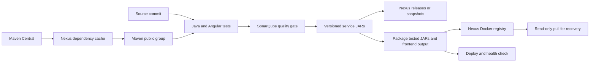

# Nexus artifact management

Nexus stores the actual Nexora Commerce build: the parent Maven POM, six Java 17
service JARs and their POMs, seven Docker images including the Angular frontend,
and a separate Java 11 artifact verifier. It also proxies Maven Central.
The verifier retrieves a versioned artifact and checks its SHA-256 against the
producing build. It is a useful JDK 11 component; the six Spring Boot 3 marketplace
services still require Java 17. A requirement to run buy-02 itself on Java 11 is
not satisfied by this split.



## Start and provision

From the repository root, with Docker Desktop running:

```powershell
.\scripts\start-nexus.ps1
```

This generates random secrets in ignored `nexus/.env`, starts the pinned Nexus
3.95.3 image as UID/GID 200:200, and creates isolated persistent storage.
The dashboard is [localhost:18081](http://localhost:18081); the authenticated
Docker registry is `localhost:18082`. Both bind to loopback by default. These
ports coexist with the marketplace, SonarQube, and the outer Jenkins stack.

On first boot, Sonatype requires you to review its
[Community Edition EULA](https://links.sonatype.com/products/nxrm/ce-eula).
If you agree, explicitly record that decision:

```powershell
.\scripts\start-nexus.ps1 -AcceptEula
```

Acceptance is never the default. Re-running the script updates the named
repositories and roles without deleting stored artifacts. Credentials remain
in `nexus/.env`; `scripts/nexus-access.ps1` displays them when explicitly run.
Use PowerShell 7 (`pwsh`) for the same provisioning scripts on Linux/macOS.

| Repository | Role |
|---|---|
| `maven-releases` | Published release POMs/JARs; replacement disabled |
| `maven-snapshots` | Mutable snapshot builds and metadata |
| `maven-central` | Proxy/cache for Maven Central dependencies and plugins |
| `maven-public` | Authenticated group exposing all three Maven repositories |
| `docker-hosted` | Versioned service/frontend images; tag replacement disabled |

The publisher can read, add and edit artifacts in the named hosted targets,
but cannot administer Nexus or delete artifacts. The reader can browse and
download only. Anonymous artifact access is disabled. Repository write policies
prevent the publisher's edit privilege from replacing a release.

## Publish a complete local release

Choose a new version each time:

```powershell
.\scripts\publish-nexus.ps1 -Version 1.0.0
.\scripts\verify-nexus.ps1 -Version 1.0.0
```

Publishing runs Maven tests and deploys all six services through Nexus using
Java 17. It then runs Angular tests, the production dependency audit, the motion
lifecycle test and the production build in Node 24, packages the tested outputs,
and pushes all seven images. Local publication does not run the SonarQube gate;
the Jenkins path below does. `-SkipDocker` publishes/verifies only Maven artifacts.

Examples of resulting coordinates:

- `com.nexora:nexora-commerce:1.0.0` (parent POM)
- `com.nexora:order-service:1.0.0` (executable service JAR)
- `localhost:18082/nexora-commerce/order-service:1.0.0`
- `localhost:18082/nexora-commerce/frontend:1.0.0`

`1.1.0-SNAPSHOT` goes to the snapshot repository. Because Docker tags are immutable,
use `-SkipDocker` for repeated snapshot publications, or give each image build a
unique prerelease version. Never reuse a published release version after a partial
failure: choose a new one. Multi-module deployment is deferred until the Maven
reactor succeeds, but Maven and Docker uploads are not one atomic transaction.

Maven `${revision}` sets one version for every module. The Flatten plugin writes
resolved parent versions to published POMs, allowing other Maven projects to
consume them. Ordinary `mvn verify` and the normal Docker quickstart continue
to work without a Nexus server. See the official
[Maven CI-friendly version guide](https://maven.apache.org/guides/mini/guide-maven-ci-friendly.html).

## Connect Jenkins

1. Start/provision Nexus, then SonarQube, then Jenkins.
2. The Jenkins start scripts import the restricted publisher credentials from
   ignored `nexus/.env`; JCasC creates the `nexus-publisher` credential automatically.
3. `PUBLISH_ARTIFACTS=true` is the Jenkins default. Public GitHub CI validates
   builds and quality on hosted runners without connecting to private Nexus.
4. On Docker Desktop, use `NEXUS_BASE_URL=http://host.docker.internal:18081`
   and `NEXUS_DOCKER_REGISTRY=host.docker.internal:18082`.

The Jenkins Docker daemon allows HTTP only for that configured local registry.
If its address changes, set `NEXUS_DOCKER_REGISTRY` in `jenkins/.env`, recreate the
daemon, and use the same value in the pipeline. For remote infrastructure, use
TLS endpoints and configure trusted certificates instead of an HTTP exception.
On native Linux, configure an address reachable from both the nested build
containers and Docker daemon; Docker Desktop host routing is not assumed there.

Jenkins derives the Maven version from its build number and source commit,
and the image tag from the commit and build number. Tests use the Nexus mirror;
publication begins only after the SonarQube gate. Runtime images copy the exact
tested JARs and compiled frontend. The existing deployment uses those same local
images; Nexus preserves a remote copy and its digests for later recovery.

Only configure publication credentials on trusted branch builds. The public
GitHub pull-request workflow receives no Nexus credentials and cannot access
your localhost. Do not move it onto a privileged local runner for pull requests.

## Verify and recover

`verify-nexus.ps1` checks repository existence, release policies, denied
administration and anonymous access, denied reader writes, denied release POM
replacement, all six downloadable JARs/resolved POMs, and a populated dependency
cache. It pulls all seven images as the reader and starts the retrieved discovery
image on a temporary loopback port, waiting for a healthy Actuator response.
Evidence is written to ignored `test-results/nexus/verification.json`.

To verify a Jenkins build, provide both identities:

```powershell
.\scripts\verify-nexus.ps1 -Version 1.0.42-abcdef123456 -ImageTag abcdef123456-42
```

For recovery on a Jenkins agent, bind a reader credential to `NEXUS_USERNAME`
and `NEXUS_PASSWORD`, set the registry and saved `IMAGE_TAG`, then run:

```bash
bash scripts/ci/nexus-images.sh pull
```

This retrieves and tags all seven images under the local names expected by
`compose.jenkins.yml`. Use the existing deployment/rollback scripts with that
tag and the appropriate environment credentials. Copying artifacts does not
restore databases or roll back database migrations.

### Verify multiple Maven versions with Java 11

The standalone [artifact verifier](../tools/artifact-verifier/README.md) builds
and runs on JDK 11. Its seven tests cover valid retrieval, mismatched bytes,
HTTP failures, redirects, and invalid coordinates. Jenkins builds and publishes
it alongside the services after the quality gate; the local service-only
`publish-nexus.ps1` command above does not publish this separate tool.

Two discovery-service releases were independently retrieved from Nexus and
matched against the SHA-256 of each producing Jenkins build's archived JAR:
`1.0.4-6acc99f8a8cf` and `1.0.5-97b1d83c9c78`. The
[verification record](evidence/artifact-versions.json) identifies both versions
and hashes. The [repository screenshot](evidence/nexus-browser.png) shows the
configured hosted, proxy, and group repositories.

Stop Nexus without deleting artifacts:

```bash
docker compose -f nexus/compose.yml down
```

Back up the `nexora-artifacts_nexus-data` volume and the ignored credentials
separately. The original educational Nexus volume and repository are untouched.
