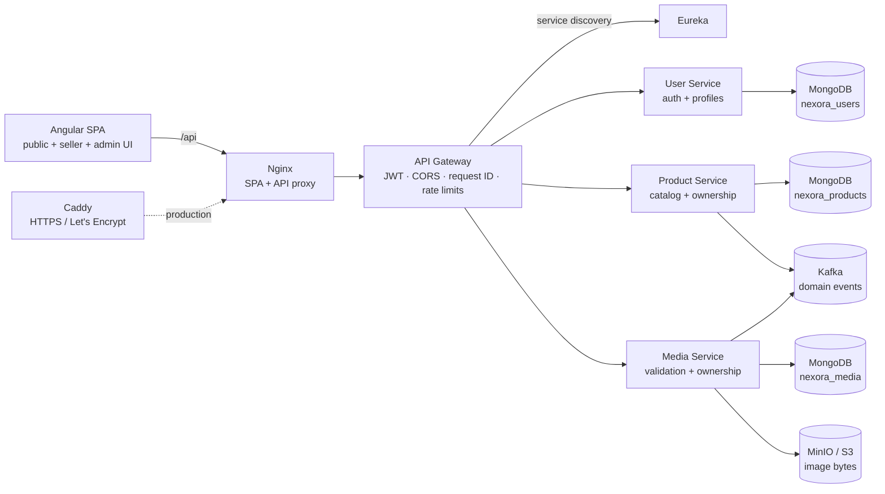
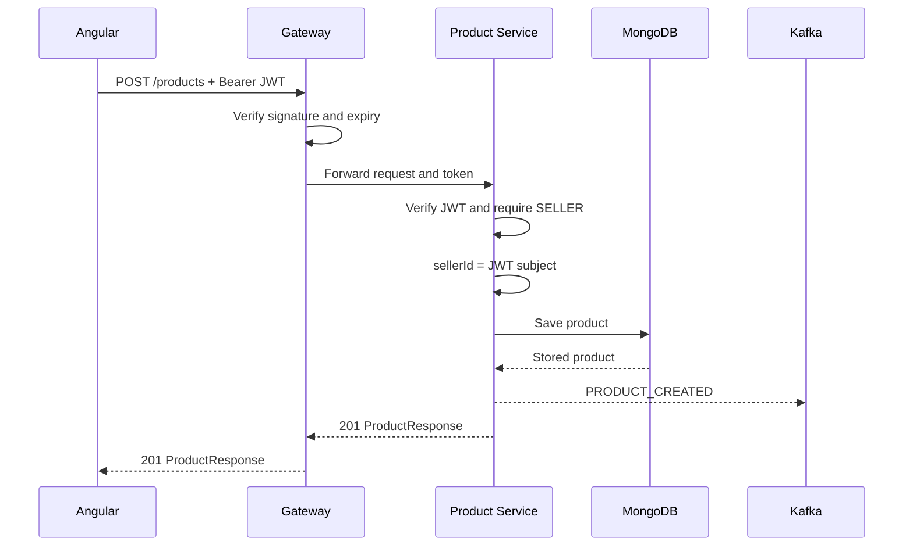
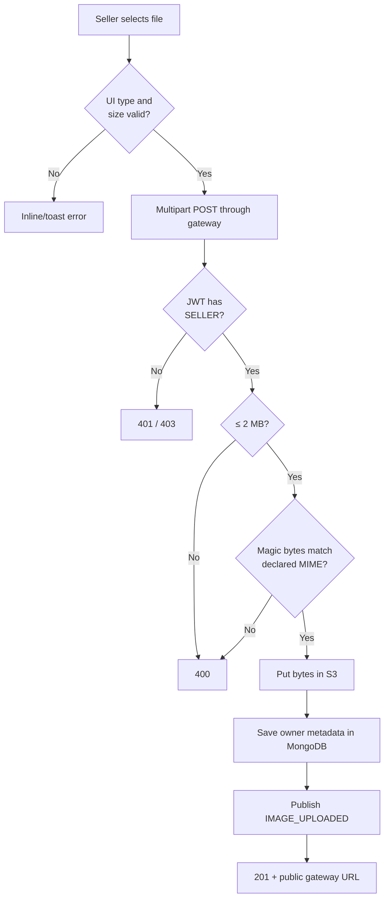

<!--
File purpose: Documents the project architecture.
-->
# Architecture

## Components

Each domain service owns its database. Product Service does not query users,
and Media Service does not mutate products. Shared identity is the signed JWT
subject. Media is linked to products through metadata and public image URLs.

## Authenticated seller write

The request body has no `sellerId`. A client cannot claim another identity.

## Image upload

If metadata persistence fails after object upload, Media Service attempts to
remove the just-created object so storage does not accumulate orphan files.

## Ports and trust boundaries

- Browsers use Nginx on 4200 locally and call relative `/api` paths.
- Nginx proxies to Gateway on the private Compose network.
- Gateway discovers logical service names through Eureka.
- Direct ports 8081–8083 exist for local debugging; production deployments
  should not publish them.
- JWT validation happens both at the gateway and at the destination service.
- Authentication and media-write token buckets are keyed by client IP at the
  gateway. A multi-gateway deployment should move counters to a shared store.
- ADMIN moderation is separately guarded in the UI, gateway, and domain
  services; public registration can create only CLIENT or SELLER identities.
- MongoDB, Kafka, and MinIO are private infrastructure in production.
