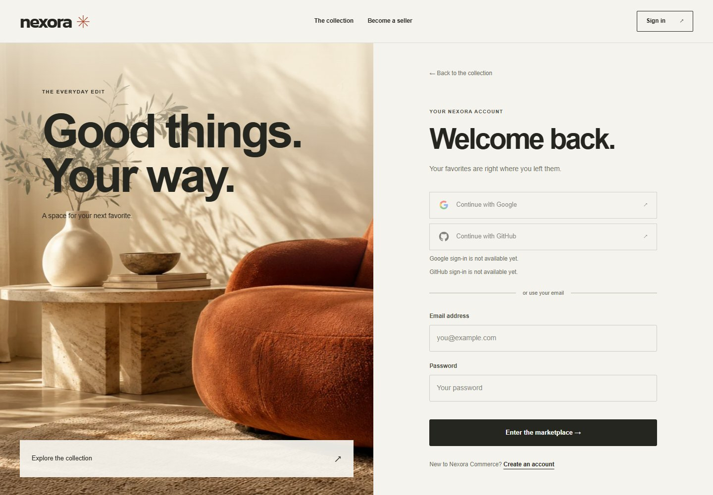

# Google and GitHub sign-in

Nexora follows the server-side sign-in pattern used in Neo4flix. Both providers
work alongside email/password authentication and issue Nexora's existing JWT.
They can be configured independently. The login and shopper registration pages
show each provider's availability; missing credentials do not break email login.



The screenshot shows an installation awaiting its provider credentials.

## Configure separate Nexora apps

Do not change the callback of an existing Neo4flix app: it would interrupt that
project's sign-in. Create separate Nexora clients instead. Keep secrets in the
ignored `.env` file. They are passed only to the user service, never Angular.

The default public origin is `http://127.0.0.1:4200`. Opening the site through
`localhost` is also fine: social sign-in first navigates to the configured origin,
so the browser's session cookie is shared with the callback. If you choose
`http://localhost:4200` instead, use that exact origin everywhere below.

| Provider | Application | Authorized callback URL |
| --- | --- | --- |
| Google | Google Auth Platform → Clients → Web application | `http://127.0.0.1:4200/api/auth/oauth2/callback/google` |
| GitHub | Settings → Developer settings → OAuth Apps → New OAuth App | `http://127.0.0.1:4200/api/auth/oauth2/callback/github` |

Use **Nexora Commerce** as the application name and the public origin as its
homepage. For Google, configure the consent audience and any required test users.
For GitHub, request identity access only; device flow and repository scopes are
unnecessary. Google uses `openid profile email`; GitHub uses `read:user user:email`.

Save credentials without showing them in terminal history:

```powershell
.\scripts\configure-oauth.ps1 -Provider google
.\scripts\configure-oauth.ps1 -Provider github
# For a different origin, add -PublicOrigin 'https://your-domain.example'
```

The script prompts privately, preserves other settings, and sets
`PUBLIC_ORIGIN`, `OAUTH_COOKIE_SECURE`, and the appropriate client ID/secret.
Copy GitHub's **Client ID** from your Nexora application under
[Settings > Developer settings > OAuth Apps](https://github.com/settings/developers),
then enter the **Client secret** at the second prompt. Paste only each value,
without labels or quotes. Surrounding copied whitespace is removed automatically.
If validation fails, nothing is saved; rerun only the failed provider's command.
Alternatively edit these variables directly in `.env`:

```dotenv
PUBLIC_ORIGIN=http://127.0.0.1:4200
OAUTH_COOKIE_SECURE=false
GOOGLE_CLIENT_ID=
GOOGLE_CLIENT_SECRET=
GITHUB_CLIENT_ID=
GITHUB_CLIENT_SECRET=
```

For public deployment use HTTPS, `OAUTH_COOKIE_SECURE=true`, the public domain in
`ALLOWED_ORIGINS`, and exactly matching provider callback URLs. Nginx strips
`/api`; the gateway restores it as a forwarded prefix after matching the OAuth
route so Spring validates the external redirect URI. Apply the same rule to
replacement proxies; adding the prefix before gateway route matching causes 404s.

With `compose.tls.yml`, the canonical origin is `https://localhost:8443` (override
with `TLS_PUBLIC_ORIGIN`). With `compose.https.yml`, it is `https://${DOMAIN}`.
Register the callbacks for the profile you actually run; both HTTPS profiles
enable Secure cookies automatically.

The Caddy HTTPS ingress sends OAuth requests directly to the gateway after
stripping `/api`, preserving the public HTTPS scheme for callback validation.
CI tests this route with a trusted local certificate and fixture upstreams;
ordinary pages and API traffic continue through the frontend proxy.

## Build and apply

Build the changed images sequentially, retaining the laptop resource limits:

```powershell
docker compose -f compose.yml -f compose.laptop.yml --parallel 1 build user-service gateway-service frontend
docker compose -f compose.yml -f compose.laptop.yml up -d --no-build --wait
```

After changing credentials alone, recreate only the user service and gateway:

```powershell
docker compose -f compose.yml -f compose.laptop.yml up -d --no-deps --wait user-service gateway-service
```

Check `/api/auth/oauth2/providers` and then open `/login` in a regular browser.
A provider being enabled means both configuration values exist; successful live
authorization also requires valid credentials and the registered callback.

## Account behavior

- New social users choose a display name and local password, then receive a
  `CLIENT` account. To open a seller account, use seller registration first.
- A matching existing email requires that Nexora account's current password
  before linking. Matching email alone never grants access.
- Returning linked users keep their account ID, orders, saved products, and
  role. Seller/admin users return to their corresponding dashboard.
- Both providers can be linked to one account. A second identity from the same
  provider cannot replace the original connection.
- The stable provider subject selects a returning account even if its provider
  email changes. Nexora does not silently replace the account email.
- Cancelling or letting the flow expire returns to sign-in without issuing a JWT.

## Security and deployment

Spring Security performs authorization-code exchange with state and PKCE S256.
For Google it validates signed OIDC tokens, issuer, audience, expiration, and
nonce, and Nexora requires a verified email. GitHub's public profile email is
ignored; the server checks its authenticated primary verified email API.

Provider access tokens are discarded after verification. Only stable provider
IDs are stored privately in MongoDB, with sparse unique indexes. Atomic account
linking preserves concurrent profile updates and rejects a competing binding.
No provider IDs or tokens are exposed in user profile responses or app JWT claims.

The temporary `NEXORA_OAUTH` cookie is HttpOnly, SameSite=Lax, restricted to
`/api/auth/oauth2`, and Secure with HTTPS configuration. The authorization session
expires after ten minutes of inactivity. Provider verification rotates it into a five-minute
completion proof. Completion has at most five attempts, checks exact Origin,
and consumes the session once. OAuth principals cannot authenticate the normal
JWT API. Nexora's existing application session storage remains unchanged.

The handshake session is local to the user-service process; restarting it cancels
pending sign-ins. Use sticky routing or a shared Spring Session store before
scaling the user service to multiple replicas. The current Compose stack runs one.
OAuth callback access logging is disabled in both bundled Nginx configurations;
keep callback query strings out of external proxy logs too.

## Verification

`OAuthSecurityTest` runs the real Spring filters against a local RSA-signed OIDC
provider. `GitHubOAuthSecurityTest` exchanges authorization codes and fetches
profile/email responses from a local HTTP provider. They check state, PKCE,
nonce, forged/expired/wrong-issuer/wrong-audience tokens, unverified email,
callback failures, Origin enforcement, and single-use completion. These test
providers exist only in test sources; they are not packaged in the application.

Service tests cover existing-account confirmation, preserved roles, safe return
routes, and competing bindings. Browser tests use explicitly mocked provider
responses to check the screens without real provider credentials. After adding
real clients, separately test Google and GitHub signup, linking, returning login,
and cancellation in your own browser.

On Windows installations where Java reports `Unable to establish loopback
connection` in these local HTTP tests, run them in the Linux build image or set
`$env:JAVA_TOOL_OPTIONS='-Djdk.net.unixdomain.tmpdir=NUL'` in the test shell.
This makes Java fall back to TCP for its local selector pipe on the affected
Windows runtime. It is unnecessary in the Linux application containers.

Official references: [Google server flow](https://developers.google.com/identity/protocols/oauth2/web-server),
[Google OpenID Connect](https://developers.google.com/identity/openid-connect/openid-connect),
[GitHub OAuth flow](https://docs.github.com/en/apps/oauth-apps/building-oauth-apps/authorizing-oauth-apps),
[GitHub verified email API](https://docs.github.com/en/rest/users/emails#list-email-addresses-for-the-authenticated-user),
and [Spring OAuth2 Login](https://docs.spring.io/spring-security/reference/servlet/oauth2/login/advanced.html).
